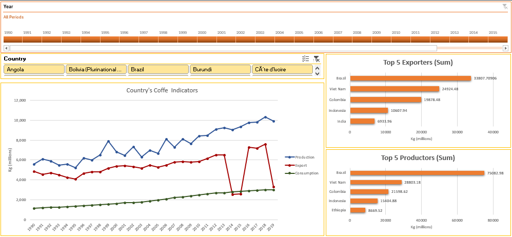

# Coffe-Production
This project aims to explore historic data from all countries that produce coffee, focusing on three main aspects: **Production**, **Consumption**, and **Export**. Primarily, this project will use data visualizations to present the findings in an compelling and comprehensible manner.

The project consist of two phases:
- *Data Processing* using PowerQuery.
- *Data Visualization*: Dashboard presentation using Excel.

The whole project can be found in the same [Excel workbook](https://github.com/maurodv09/Coffe-Production/blob/main/Coffe_project.xlsx)

*Detailed documentacion of the steps taken in the data processing phase can be found in the [documentation](https://github.com/maurodv09/Coffe-Production/blob/main/Data-Processing-Documentation.md)

## Results
Dashboard snapshot

## Dataset
The data originates from the [OCI website](https://ico.org/) and can be dowloaded from [this Kaggle Dataset](https://www.kaggle.com/datasets/michals22/coffee-dataset)

The dataset consist of three CSV files(Coffee_production.csv, Coffee_export.csv, Coffee_domestic_consumption.csv) saved in a same excel file located at coffe_data/coffe_data.xlsx relative to the project workbook. The folder structure is necessary to run the Excel query correctly.

## Tools
- Microsoft Excel
- PowerQuery
